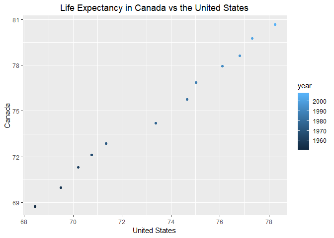

STAT 545A Homework 4
================
Lucy Bellemare
October 3, 2018

-   [Introduction](#introduction)
-   [Data Reshaping](#data-reshaping)
-   [Data Joining](#data-joining)
    -   [Data Joining Introduction](#data-joining-introduction)
    -   [inner\_join()](#inner_join)
    -   [left\_join() and right\_join()](#left_join-and-right_join)
    -   [full\_join()](#full_join)
    -   [semi-join()](#semi_join)
    -   [anti-join()](#anti_join)

Introduction
============

The goal of this assignment is to gain experience applying a variety of data wrangling tools to realistic problems. We aim to come up with concise, repeatable, and understandable ways to manipulate data to serve our purposes.

``` r
library(tidyverse)
library(knitr)
library(gapminder)
#Set ggplot titles to be centred
theme_update(plot.title = element_text(hjust = 0.5))
```

Data Reshaping
==============

Activity \#2

Make a tibble with one row per year and columns for life expectancy for two or more countries. Use knitr::kable() to make this table look pretty in your rendered homework. Take advantage of this new data shape to scatterplot life expectancy for one country against that of another.

``` r
gapminder %>% 
  filter(country == "Canada" | country == "United States") %>% 
  select(country, year, lifeExp) %>% 
  spread(key=country, value=lifeExp) %>% 
  kable()
```

|  year|  Canada|  United States|
|-----:|-------:|--------------:|
|  1952|  68.750|         68.440|
|  1957|  69.960|         69.490|
|  1962|  71.300|         70.210|
|  1967|  72.130|         70.760|
|  1972|  72.880|         71.340|
|  1977|  74.210|         73.380|
|  1982|  75.760|         74.650|
|  1987|  76.860|         75.020|
|  1992|  77.950|         76.090|
|  1997|  78.610|         76.810|
|  2002|  79.770|         77.310|
|  2007|  80.653|         78.242|

``` r
gapminder %>% 
  filter(country == "Canada" | country == "United States") %>% 
  select(country, year, lifeExp) %>% 
  spread(key=country, value=lifeExp) %>%
  ggplot(aes(`United States`, Canada)) + 
    geom_point(aes(colour=year)) +
    ggtitle("Life Expectancy in Canada vs the United States")
```



From this we can see that life expectancy in Canada is highly correlated with life expectancy in the United States.

Data Joining
============

Activity \#2

Create your own cheatsheet patterned after Jenny's but focused on something you care about more than comics!

For this activity I'm going to generate data on the top 10 pharmaceutical companies and the top 20 drugs in the world. These data frames will be used to illustrate inner\_join, lef\_join, right\_join, full\_join, semi\_join, and anti-join.

Data Joining Introduction
-------------------------

Joining dataframes together is an essential part of data wrangling and a precursor to most analysis. There are many functions to perform joins as there are many different ways to join data. Before I start showing examples let me just clarify a few things:

-   Most data joins are not symmetric operations. This means that the order with which you enter your input data frames, will affect the result.
-   Data joins require datasets to have column variables in common. These common columns are used to match up data from each frame. You can specify which columns to be used in matching by specifying them as the "by="ColName"".
    -   The default is to match using all common column names between the two data frames, so be aware of that. This means you can omit the "by" parameter if you are confident you know your dataframes.
    -   You can specify to match using columns with different names in each dataset. For example by = c("AA" = "BB") will match `x$AA` to `y$BB`.

Let's start with building the pharmaceutical company data. It will have the following form:

| Variable     | Description                                               |
|--------------|-----------------------------------------------------------|
| Company      | Name of the pharmaceutical company                        |
| Revenue      | Total revenue from Pharmaceutical segment in USD billions |
| AnnualGrowth | Annual pharmaceutical revenue growth 2016-2017            |
| HQCountry    | Country the company has its headquarters in               |

In practice, the dataset looks like this:

``` r
pharmData <- tribble(~Company, ~Revenue, ~AnnualGrowth, ~HQCountry, 
                "Roche", 44368, 12.34, "Switzerland",
                "Pfizer", 52540, -0.53, "United States",
                "AbbVie", 28216, 10.39, "United States",
                "Johnson & Johnson", 36256, 8.34, "United States",
                "Sanofi", 36663, 4.2, "France",
                "Merck", 35390, 1.0, "United States",
                "Novartis", 33000, 1.35, "Switzerland",
                "Gilead Sciences", 25662, -15.55, "United States",
                "GlaxoSmithKline", 24038, 7.0, "United Kingdom",
                "Amgen", 22849, -1.0, "United States")
#Revenue = Total revenue from Pharmaceutical segment in USD billions
#AnnualGrowth = Annual pharmaceutical revenue growth 2016-2017

#Source: https://www.igeahub.com/2018/03/06/top-10-pharmaceutical-companies-2018/

kable(pharmData)
```

| Company           |  Revenue|  AnnualGrowth| HQCountry      |
|:------------------|--------:|-------------:|:---------------|
| Roche             |    44368|         12.34| Switzerland    |
| Pfizer            |    52540|         -0.53| United States  |
| AbbVie            |    28216|         10.39| United States  |
| Johnson & Johnson |    36256|          8.34| United States  |
| Sanofi            |    36663|          4.20| France         |
| Merck             |    35390|          1.00| United States  |
| Novartis          |    33000|          1.35| Switzerland    |
| Gilead Sciences   |    25662|        -15.55| United States  |
| GlaxoSmithKline   |    24038|          7.00| United Kingdom |
| Amgen             |    22849|         -1.00| United States  |

The top drug data has the following form:

| Variable     | Description                                            |
|--------------|--------------------------------------------------------|
| Drug         | Name of the drug                                       |
| Company      | Name of the pharmaceutical company that makes the drug |
| Indication   | What this drug is prescribed to treat                  |
| PatentExpiry | When is the US patent for this drug set to expire      |

In practice, the drug data looks like this:

``` r
drugData <- tribble(~Drug, ~Company, ~Indication, ~PatentExpiry,
                    "Humira", "AbbVie", "Autoimmune diseases", 2016,
                    "Harvoni", "Gilead Sciences", "HCV/HIV-1", 2030,
                    "Enbrel etanercept", "Amgen", "Autoimmune diseases", 2019,
                    "Enbrel etanercept", "Pfizer", "Autoimmune diseases", 2019,
                    "Rituxan Rituximab", "Roche", "Cancer", 2015,
                    "Rituxan Rituximab", "Biogen", "Cancer", 2015,
                    "Remicade infliximab", "Johnson & Johnson", "Autoimmune diseases", 2018,
                    "Remicade infliximab", "Merck", "Autoimmune diseases", 2018,
                    "Avastin", "Roche", "Cancer", 2019, 
                    "Herceptin", "Roche", "Cancer", 2019, 
                    "Januvia", "Merck", "Diabetes", 2022,
                    "Lantus", "Sanofi", "Diabetes", 2014,
                    "Prevnar 13", "Pfizer", "Pneumococcal vaccine", 2026,
                    "Xarelto rivaroxaban", "Bayer", "Anticoagulant", 2020,
                    "Xarelto rivaroxaban", "Johnson & Johnson", "Anticoagulant", 2020,
                    "Eylea", "Bayer", "Macular degeneration", 2027,
                    "Eylea", "Regeneron Pharmaceuticals", "Macular degeneration", 2027,
                    "Lyrica pergabalin", "Pfizer", "Epilepsy", 2018,
                    "Neulasta", "Amgen", "Neutropenia", 2015,
                    "Neulasta", "Kyowa Hakko Kirin", "Neutropenia", 2015,
                    "Advair", "GlaxoSmithKline", "Asthma", 2016,
                    "Copaxone", "Teva Pharmaceuticals", "Multiple sclerosis", 2014,
                    "Sovaldi sofosbuvir", "Gilead Sciences", "HCV", 2029,
                    "Tecfidera", "Biogen", "Multiple sclerosis", 2018,
                    "OPD1VO", "Bristol-Myers Squibb", "Melanoma", 2023)

#Source: https://www.igeahub.com/2017/08/08/top-20-drugs-in-the-world-2017/
kable(drugData)
```

| Drug                | Company                   | Indication           |  PatentExpiry|
|:--------------------|:--------------------------|:---------------------|-------------:|
| Humira              | AbbVie                    | Autoimmune diseases  |          2016|
| Harvoni             | Gilead Sciences           | HCV/HIV-1            |          2030|
| Enbrel etanercept   | Amgen                     | Autoimmune diseases  |          2019|
| Enbrel etanercept   | Pfizer                    | Autoimmune diseases  |          2019|
| Rituxan Rituximab   | Roche                     | Cancer               |          2015|
| Rituxan Rituximab   | Biogen                    | Cancer               |          2015|
| Remicade infliximab | Johnson & Johnson         | Autoimmune diseases  |          2018|
| Remicade infliximab | Merck                     | Autoimmune diseases  |          2018|
| Avastin             | Roche                     | Cancer               |          2019|
| Herceptin           | Roche                     | Cancer               |          2019|
| Januvia             | Merck                     | Diabetes             |          2022|
| Lantus              | Sanofi                    | Diabetes             |          2014|
| Prevnar 13          | Pfizer                    | Pneumococcal vaccine |          2026|
| Xarelto rivaroxaban | Bayer                     | Anticoagulant        |          2020|
| Xarelto rivaroxaban | Johnson & Johnson         | Anticoagulant        |          2020|
| Eylea               | Bayer                     | Macular degeneration |          2027|
| Eylea               | Regeneron Pharmaceuticals | Macular degeneration |          2027|
| Lyrica pergabalin   | Pfizer                    | Epilepsy             |          2018|
| Neulasta            | Amgen                     | Neutropenia          |          2015|
| Neulasta            | Kyowa Hakko Kirin         | Neutropenia          |          2015|
| Advair              | GlaxoSmithKline           | Asthma               |          2016|
| Copaxone            | Teva Pharmaceuticals      | Multiple sclerosis   |          2014|
| Sovaldi sofosbuvir  | Gilead Sciences           | HCV                  |          2029|
| Tecfidera           | Biogen                    | Multiple sclerosis   |          2018|
| OPD1VO              | Bristol-Myers Squibb      | Melanoma             |          2023|

For certain drugs, there are two rows. This is to indicate that the drug is jointly produced by two different pharmaceutical companies. I thought this would be a better way to organize the data as now there is one row per drug and company combination (observational unit).

inner\_join
-----------

An inner\_join(x, y) is defined as :

Return all rows from x where there are matching values in y, and all columns from x and y. If there are multiple matches between x and y, all combination of the matches are returned.

``` r
inner_join(pharmData, drugData) %>% 
  kable()
```

    ## Joining, by = "Company"

| Company           |  Revenue|  AnnualGrowth| HQCountry      | Drug                | Indication           |  PatentExpiry|
|:------------------|--------:|-------------:|:---------------|:--------------------|:---------------------|-------------:|
| Roche             |    44368|         12.34| Switzerland    | Rituxan Rituximab   | Cancer               |          2015|
| Roche             |    44368|         12.34| Switzerland    | Avastin             | Cancer               |          2019|
| Roche             |    44368|         12.34| Switzerland    | Herceptin           | Cancer               |          2019|
| Pfizer            |    52540|         -0.53| United States  | Enbrel etanercept   | Autoimmune diseases  |          2019|
| Pfizer            |    52540|         -0.53| United States  | Prevnar 13          | Pneumococcal vaccine |          2026|
| Pfizer            |    52540|         -0.53| United States  | Lyrica pergabalin   | Epilepsy             |          2018|
| AbbVie            |    28216|         10.39| United States  | Humira              | Autoimmune diseases  |          2016|
| Johnson & Johnson |    36256|          8.34| United States  | Remicade infliximab | Autoimmune diseases  |          2018|
| Johnson & Johnson |    36256|          8.34| United States  | Xarelto rivaroxaban | Anticoagulant        |          2020|
| Sanofi            |    36663|          4.20| France         | Lantus              | Diabetes             |          2014|
| Merck             |    35390|          1.00| United States  | Remicade infliximab | Autoimmune diseases  |          2018|
| Merck             |    35390|          1.00| United States  | Januvia             | Diabetes             |          2022|
| Gilead Sciences   |    25662|        -15.55| United States  | Harvoni             | HCV/HIV-1            |          2030|
| Gilead Sciences   |    25662|        -15.55| United States  | Sovaldi sofosbuvir  | HCV                  |          2029|
| GlaxoSmithKline   |    24038|          7.00| United Kingdom | Advair              | Asthma               |          2016|
| Amgen             |    22849|         -1.00| United States  | Enbrel etanercept   | Autoimmune diseases  |          2019|
| Amgen             |    22849|         -1.00| United States  | Neulasta            | Neutropenia          |          2015|

This result is characterized by:

-   Provides a complete dataset of the top 20 drugs that are made by the top 10 pharmaceutical companies.
-   Drugs that are not made by a top 10 company, and top 10 companies that do not make a top 20 drug are not listed.
-   Data duplication occurs for the columns originating from the "pharmData" dataset so that companies with multiple top 20 drugs have company information listed for each drug.

left\_join and right\_join
--------------------------

A left\_join(x,y) is defined as:

return all rows from x, and all columns from x and y. Rows in x with no match in y will have NA values in the new columns. If there are multiple matches between x and y, all combinations of the matches are returned.

A right\_join(x,y) is defined as return all rows from y, and all columns from x and y. Rows in y with no match in x will have NA values in the new columns. If there are multiple matches between x and y, all combinations of the matches are returned.

These joins can be interpretted as "left join = keep all the rows from the left table, adding NA to the columns from y as necessary". It's important to note that the results of left\_join(x,y) will not match right\_join(x,y), but that left\_join(x,y) will match right\_join(y, x).

``` r
left_join(pharmData, drugData) %>% 
  kable()
```

    ## Joining, by = "Company"

| Company           |  Revenue|  AnnualGrowth| HQCountry      | Drug                | Indication           |  PatentExpiry|
|:------------------|--------:|-------------:|:---------------|:--------------------|:---------------------|-------------:|
| Roche             |    44368|         12.34| Switzerland    | Rituxan Rituximab   | Cancer               |          2015|
| Roche             |    44368|         12.34| Switzerland    | Avastin             | Cancer               |          2019|
| Roche             |    44368|         12.34| Switzerland    | Herceptin           | Cancer               |          2019|
| Pfizer            |    52540|         -0.53| United States  | Enbrel etanercept   | Autoimmune diseases  |          2019|
| Pfizer            |    52540|         -0.53| United States  | Prevnar 13          | Pneumococcal vaccine |          2026|
| Pfizer            |    52540|         -0.53| United States  | Lyrica pergabalin   | Epilepsy             |          2018|
| AbbVie            |    28216|         10.39| United States  | Humira              | Autoimmune diseases  |          2016|
| Johnson & Johnson |    36256|          8.34| United States  | Remicade infliximab | Autoimmune diseases  |          2018|
| Johnson & Johnson |    36256|          8.34| United States  | Xarelto rivaroxaban | Anticoagulant        |          2020|
| Sanofi            |    36663|          4.20| France         | Lantus              | Diabetes             |          2014|
| Merck             |    35390|          1.00| United States  | Remicade infliximab | Autoimmune diseases  |          2018|
| Merck             |    35390|          1.00| United States  | Januvia             | Diabetes             |          2022|
| Novartis          |    33000|          1.35| Switzerland    | NA                  | NA                   |            NA|
| Gilead Sciences   |    25662|        -15.55| United States  | Harvoni             | HCV/HIV-1            |          2030|
| Gilead Sciences   |    25662|        -15.55| United States  | Sovaldi sofosbuvir  | HCV                  |          2029|
| GlaxoSmithKline   |    24038|          7.00| United Kingdom | Advair              | Asthma               |          2016|
| Amgen             |    22849|         -1.00| United States  | Enbrel etanercept   | Autoimmune diseases  |          2019|
| Amgen             |    22849|         -1.00| United States  | Neulasta            | Neutropenia          |          2015|

This result is characterized as:

-   All of the top 10 pharmaceutical companies, with an additional row for each additional top 20 drug that they produce. Novartis does not produce a top 20 drug, so the values of the "Drug", "Indication", and "PatentExpiry" columns are populated with NA.

The corresponding right\_join is:

``` r
right_join(pharmData, drugData) %>% 
  kable()
```

    ## Joining, by = "Company"

| Company                   |  Revenue|  AnnualGrowth| HQCountry      | Drug                | Indication           |  PatentExpiry|
|:--------------------------|--------:|-------------:|:---------------|:--------------------|:---------------------|-------------:|
| AbbVie                    |    28216|         10.39| United States  | Humira              | Autoimmune diseases  |          2016|
| Gilead Sciences           |    25662|        -15.55| United States  | Harvoni             | HCV/HIV-1            |          2030|
| Amgen                     |    22849|         -1.00| United States  | Enbrel etanercept   | Autoimmune diseases  |          2019|
| Pfizer                    |    52540|         -0.53| United States  | Enbrel etanercept   | Autoimmune diseases  |          2019|
| Roche                     |    44368|         12.34| Switzerland    | Rituxan Rituximab   | Cancer               |          2015|
| Biogen                    |       NA|            NA| NA             | Rituxan Rituximab   | Cancer               |          2015|
| Johnson & Johnson         |    36256|          8.34| United States  | Remicade infliximab | Autoimmune diseases  |          2018|
| Merck                     |    35390|          1.00| United States  | Remicade infliximab | Autoimmune diseases  |          2018|
| Roche                     |    44368|         12.34| Switzerland    | Avastin             | Cancer               |          2019|
| Roche                     |    44368|         12.34| Switzerland    | Herceptin           | Cancer               |          2019|
| Merck                     |    35390|          1.00| United States  | Januvia             | Diabetes             |          2022|
| Sanofi                    |    36663|          4.20| France         | Lantus              | Diabetes             |          2014|
| Pfizer                    |    52540|         -0.53| United States  | Prevnar 13          | Pneumococcal vaccine |          2026|
| Bayer                     |       NA|            NA| NA             | Xarelto rivaroxaban | Anticoagulant        |          2020|
| Johnson & Johnson         |    36256|          8.34| United States  | Xarelto rivaroxaban | Anticoagulant        |          2020|
| Bayer                     |       NA|            NA| NA             | Eylea               | Macular degeneration |          2027|
| Regeneron Pharmaceuticals |       NA|            NA| NA             | Eylea               | Macular degeneration |          2027|
| Pfizer                    |    52540|         -0.53| United States  | Lyrica pergabalin   | Epilepsy             |          2018|
| Amgen                     |    22849|         -1.00| United States  | Neulasta            | Neutropenia          |          2015|
| Kyowa Hakko Kirin         |       NA|            NA| NA             | Neulasta            | Neutropenia          |          2015|
| GlaxoSmithKline           |    24038|          7.00| United Kingdom | Advair              | Asthma               |          2016|
| Teva Pharmaceuticals      |       NA|            NA| NA             | Copaxone            | Multiple sclerosis   |          2014|
| Gilead Sciences           |    25662|        -15.55| United States  | Sovaldi sofosbuvir  | HCV                  |          2029|
| Biogen                    |       NA|            NA| NA             | Tecfidera           | Multiple sclerosis   |          2018|
| Bristol-Myers Squibb      |       NA|            NA| NA             | OPD1VO              | Melanoma             |          2023|

This result is characterized by:

-   All of the top 20 drugs, with rows for each of their associated companies. For top 20 drugs that are associated with a non-top 10 company, the values of the "Revenue", "AnnualGrowth", and "HQCountry" are populated with NA.

Again, note that:

left\_join(x,y) == right\_join(y,x)

full\_join
----------

A full\_join(x,y) is characterized as:

return all rows and all columns from both x and y. Where there are not matching values, returns NA for the one missing.

``` r
full_join(pharmData, drugData) %>% 
  kable()
```

    ## Joining, by = "Company"

| Company                   |  Revenue|  AnnualGrowth| HQCountry      | Drug                | Indication           |  PatentExpiry|
|:--------------------------|--------:|-------------:|:---------------|:--------------------|:---------------------|-------------:|
| Roche                     |    44368|         12.34| Switzerland    | Rituxan Rituximab   | Cancer               |          2015|
| Roche                     |    44368|         12.34| Switzerland    | Avastin             | Cancer               |          2019|
| Roche                     |    44368|         12.34| Switzerland    | Herceptin           | Cancer               |          2019|
| Pfizer                    |    52540|         -0.53| United States  | Enbrel etanercept   | Autoimmune diseases  |          2019|
| Pfizer                    |    52540|         -0.53| United States  | Prevnar 13          | Pneumococcal vaccine |          2026|
| Pfizer                    |    52540|         -0.53| United States  | Lyrica pergabalin   | Epilepsy             |          2018|
| AbbVie                    |    28216|         10.39| United States  | Humira              | Autoimmune diseases  |          2016|
| Johnson & Johnson         |    36256|          8.34| United States  | Remicade infliximab | Autoimmune diseases  |          2018|
| Johnson & Johnson         |    36256|          8.34| United States  | Xarelto rivaroxaban | Anticoagulant        |          2020|
| Sanofi                    |    36663|          4.20| France         | Lantus              | Diabetes             |          2014|
| Merck                     |    35390|          1.00| United States  | Remicade infliximab | Autoimmune diseases  |          2018|
| Merck                     |    35390|          1.00| United States  | Januvia             | Diabetes             |          2022|
| Novartis                  |    33000|          1.35| Switzerland    | NA                  | NA                   |            NA|
| Gilead Sciences           |    25662|        -15.55| United States  | Harvoni             | HCV/HIV-1            |          2030|
| Gilead Sciences           |    25662|        -15.55| United States  | Sovaldi sofosbuvir  | HCV                  |          2029|
| GlaxoSmithKline           |    24038|          7.00| United Kingdom | Advair              | Asthma               |          2016|
| Amgen                     |    22849|         -1.00| United States  | Enbrel etanercept   | Autoimmune diseases  |          2019|
| Amgen                     |    22849|         -1.00| United States  | Neulasta            | Neutropenia          |          2015|
| Biogen                    |       NA|            NA| NA             | Rituxan Rituximab   | Cancer               |          2015|
| Bayer                     |       NA|            NA| NA             | Xarelto rivaroxaban | Anticoagulant        |          2020|
| Bayer                     |       NA|            NA| NA             | Eylea               | Macular degeneration |          2027|
| Regeneron Pharmaceuticals |       NA|            NA| NA             | Eylea               | Macular degeneration |          2027|
| Kyowa Hakko Kirin         |       NA|            NA| NA             | Neulasta            | Neutropenia          |          2015|
| Teva Pharmaceuticals      |       NA|            NA| NA             | Copaxone            | Multiple sclerosis   |          2014|
| Biogen                    |       NA|            NA| NA             | Tecfidera           | Multiple sclerosis   |          2018|
| Bristol-Myers Squibb      |       NA|            NA| NA             | OPD1VO              | Melanoma             |          2023|

This result can be characterized by:

-   All top 20 drugs and all top 10 companies. Drugs made from non-top 10 companies have missing information for the "Revenue", "AnnualGrowth", and "HQCountry" columns while top 10 companies with no top 20 drugs have missing information for "Drug", "Indication", and "PatentExpiry".

semi\_join
----------

A semi\_join(x,y) is defined as:

return all rows from x where there are matching values in y, keeping just columns from x. A semi join differs from an inner join because an inner join will return one row of x for each matching row of y, where a semi join will never duplicate rows of x.

``` r
semi_join(pharmData, drugData) %>% 
  kable()
```

    ## Joining, by = "Company"

| Company           |  Revenue|  AnnualGrowth| HQCountry      |
|:------------------|--------:|-------------:|:---------------|
| Roche             |    44368|         12.34| Switzerland    |
| Pfizer            |    52540|         -0.53| United States  |
| AbbVie            |    28216|         10.39| United States  |
| Johnson & Johnson |    36256|          8.34| United States  |
| Sanofi            |    36663|          4.20| France         |
| Merck             |    35390|          1.00| United States  |
| Gilead Sciences   |    25662|        -15.55| United States  |
| GlaxoSmithKline   |    24038|          7.00| United Kingdom |
| Amgen             |    22849|         -1.00| United States  |

This result can be characterized as:

-   Return the pharmData rows for all pharmaceutical companies that have top 20 drugs. The information on what top 20 drugs are associated with each company are not added.

anti\_join
----------

A anti\_join(x,y) is defined as:

return all rows from x where there are not matching values in y, keeping just columns from x.

``` r
anti_join(pharmData, drugData) %>% 
  kable()
```

    ## Joining, by = "Company"

| Company  |  Revenue|  AnnualGrowth| HQCountry   |
|:---------|--------:|-------------:|:------------|
| Novartis |    33000|          1.35| Switzerland |

This result can be characterized as:

-   Return the top 10 pharmaceutical companies that do not produce a top 20 drug. As there are no matching drug data, it makes sense that it is omitted.
